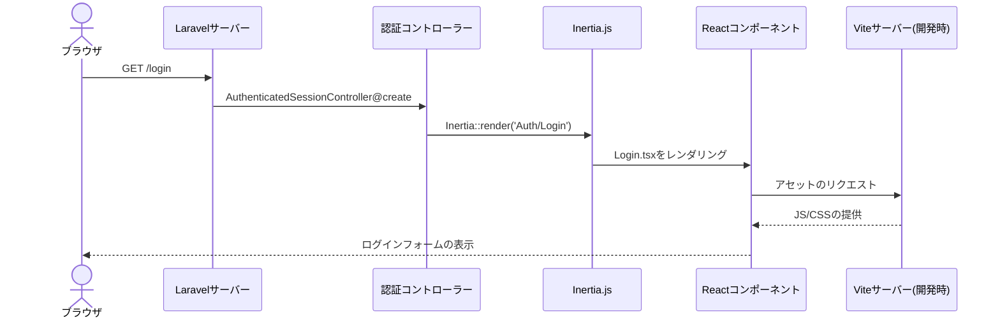
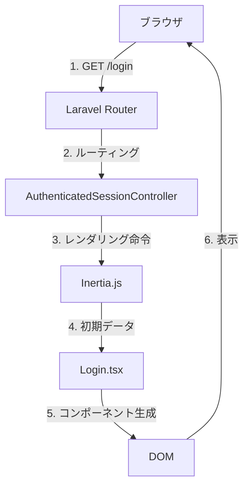
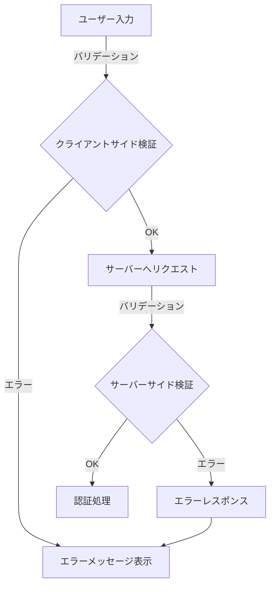

# /login エンドポイントの処理フロー設計書

## 1. 概要

このドキュメントでは、`/login` エンドポイントにアクセスした際の処理フローを詳細に説明します。

## 2. シーケンス図



## 3. 処理フローの詳細

### 3.1 ルーティング処理
- エントリーポイント: `routes/auth.php`
```php
Route::get('login', [AuthenticatedSessionController::class, 'create'])
    ->name('login');
```

### 3.2 コントローラー処理
- 担当クラス: `App\Http\Controllers\Auth\AuthenticatedSessionController`
- メソッド: `create()`
```php
public function create(): Response
{
    return Inertia::render('Auth/Login', [
        'canResetPassword' => Route::has('password.request'),
        'status' => session('status'),
    ]);
}
```

### 3.3 Inertia.js による View 処理
- テンプレート: `resources/views/app.blade.php`
- 主な役割:
  - Reactアプリケーションのブートストラップ
  - 初期データの受け渡し
  - アセットの読み込み

### 3.4 Reactコンポーネントの処理
- コンポーネント: `resources/js/Pages/Auth/Login.tsx`
- 主な機能:
  - ログインフォームの表示
  - バリデーション
  - フォームデータの送信
  - エラー表示

## 4. データフロー



## 5. セキュリティ考慮事項

1. CSRF保護
   - LaravelのCSRF保護メカニズムが自動的に適用
   - すべてのフォームにCSRFトークンが含まれる

2. セッション管理
   - Laravelのセッション機能を使用
   - セッションデータはサーバーサイドで管理

3. 入力検証
   - サーバーサイド: LaravelのValidation
   - クライアントサイド: Reactでのフォームバリデーション

## 6. エラーハンドリング



## 7. パフォーマンス考慮事項

1. アセット最適化
   - Viteによる開発時の高速リロード
   - 本番環境でのアセットの最適化

2. レンダリング最適化
   - SPAライクな動作による高速なページ遷移
   - 必要なデータのみを更新

## 8. 開発環境と本番環境の違い

| 項目 | 開発環境 | 本番環境 |
|------|----------|----------|
| アセット提供 | Viteサーバー (HMR) | 静的ファイル |
| デバッグ情報 | 詳細に表示 | 無効化 |
| ソースマップ | 有効 | 無効 |
| キャッシュ | 無効 | 有効 |
