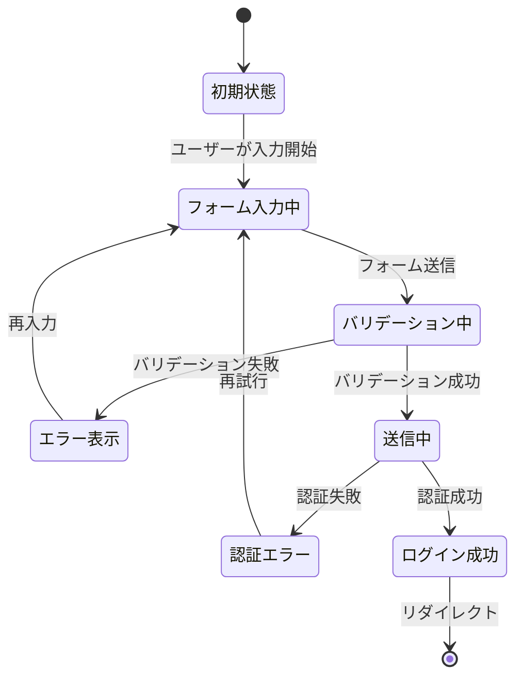

# ログイン処理の状態遷移設計

## 1. ログインフォームの状態遷移図



## 2. フォームの状態管理

### 2.1 状態の種類

1. フォームの入力値
   - email
   - password
   - remember（ログイン状態を保持）

2. UI の状態
   - isLoading（送信中）
   - errors（エラーメッセージ）
   - isSubmitted（送信済み）

### 2.2 状態遷移のトリガー

| トリガー | 前の状態 | 次の状態 | アクション |
|----------|----------|----------|------------|
| 入力開始 | 初期状態 | フォーム入力中 | フォームフィールドの値を更新 |
| 送信ボタンクリック | フォーム入力中 | バリデーション中 | クライアントサイドバリデーション実行 |
| バリデーションOK | バリデーション中 | 送信中 | サーバーへリクエスト送信 |
| バリデーションNG | バリデーション中 | エラー表示 | エラーメッセージ表示 |
| 認証成功 | 送信中 | ログイン成功 | ダッシュボードへリダイレクト |
| 認証失敗 | 送信中 | 認証エラー | エラーメッセージ表示 |

## 3. エラーハンドリングの詳細

### 3.1 クライアントサイドのバリデーション

```typescript
interface ValidationErrors {
    email?: string[];
    password?: string[];
}

interface FormData {
    email: string;
    password: string;
    remember: boolean;
}
```

### 3.2 エラーメッセージの種類

1. フォームバリデーションエラー
   - メールアドレス形式が不正
   - パスワードが未入力
   - その他の入力値検証エラー

2. 認証エラー
   - アカウントが存在しない
   - パスワードが一致しない
   - アカウントがロックされている

3. システムエラー
   - 通信エラー
   - サーバーエラー
   - その他の予期せぬエラー

## 4. セキュリティ状態の管理

### 4.1 認証トークンの管理


### 4.2 セッション状態

- 未認証
- 認証中
- 認証済み
- 認証切れ
- ログアウト
